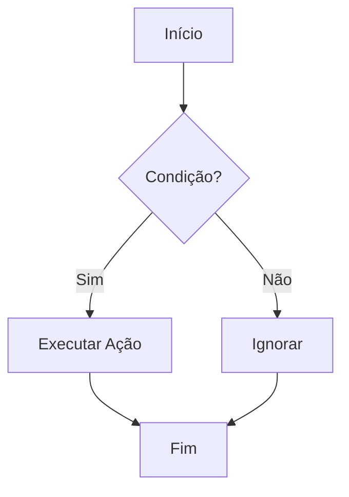

# Showcase Completo de Markdown

> Este arquivo demonstra **todas** as funcionalidades disponíveis na sintaxe Markdown.

---

## 1. Títulos (Headings)

# Título H1
## Título H2
### Título H3
#### Título H4
##### Título H5
###### Título H6

---

## 2. Ênfase de Texto

Texto normal sem formatação.

**Negrito com asteriscos duplos**

__Negrito com underscores duplos__

*Itálico com asterisco simples*

_Itálico com underscore simples_

***Negrito e itálico juntos***

~~Texto tachado (strikethrough)~~

`Código inline`

==Texto destacado (highlight)== *(suporte varia por visualizador)*

Texto com^sobrescrito^ *(suporte varia)*

Texto com~subscrito~ *(suporte varia)*

---

## 3. Parágrafos e Quebras de Linha

Este é o primeiro parágrafo. Ele pode ter várias frases seguidas sem quebra de linha real.

Este é o segundo parágrafo, separado por uma linha em branco.

Esta linha termina com dois espaços para forçar quebra  
e esta é a linha seguinte (soft break).

---

## 4. Citações (Blockquotes)

> Citação simples de um parágrafo.

> Citação com **formatação** dentro dela.
> Continuação da mesma citação.

> Primeiro nível de citação.
>
> > Segundo nível aninhado.
> >
> > > Terceiro nível aninhado.

---

## 5. Listas

### Lista não ordenada

- Item A
- Item B
  - Sub-item B1
  - Sub-item B2
    - Sub-sub-item B2a
- Item C

### Lista com marcadores alternativos

* Asterisco
+ Sinal de mais
- Hífen

### Lista ordenada

1. Primeiro
2. Segundo
3. Terceiro
   1. Sub-item 3.1
   2. Sub-item 3.2
4. Quarto

### Lista de tarefas (Task List)

- [x] Tarefa concluída
- [x] Outra tarefa concluída
- [ ] Tarefa pendente
- [ ] Outra tarefa pendente

---

## 6. Links

[Link simples](https://www.exemplo.com)

[Link com título ao passar o mouse](https://www.exemplo.com "Título do link")

[Link por referência][ref1]

[ref1]: https://www.exemplo.com "Referência externa"

URL automática: <https://www.exemplo.com>

E-mail automático: <email@exemplo.com>

---

## 7. Imagens


Imagem por referência:

![Alt texto][imagem-ref]

[imagem-ref]: https://picsum.photos/400/150 "Imagem via referência"

---

## 8. Código

### Inline

Use o comando `npm install` para instalar dependências.

### Bloco sem linguagem

```
Bloco de código genérico
sem destaque de sintaxe
```

### JavaScript

```javascript
const saudacao = (nome) => {
  return `Olá, ${nome}!`;
};

console.log(saudacao("Mundo"));
```

### Python

```python
def fatorial(n):
    if n == 0:
        return 1
    return n * fatorial(n - 1)

print(fatorial(5))  # 120
```

### HTML

```html
<!DOCTYPE html>
<html lang="pt-BR">
  <head>
    <meta charset="UTF-8" />
    <title>Exemplo</title>
  </head>
  <body>
    <p>Olá, Mundo!</p>
  </body>
</html>
```

### CSS

```css
body {
  font-family: sans-serif;
  background-color: #f5f5f5;
  margin: 0;
  padding: 16px;
}
```

### Bash

```bash
#!/bin/bash
echo "Iniciando script..."
for i in {1..5}; do
  echo "Iteração $i"
done
```

### JSON

```json
{
  "nome": "Marcelo",
  "idade": 30,
  "habilidades": ["Python", "JavaScript", "Markdown"],
  "ativo": true
}
```

---

## 9. Tabelas

### Tabela básica

| Coluna A | Coluna B | Coluna C |
|----------|----------|----------|
| Valor 1  | Valor 2  | Valor 3  |
| Valor 4  | Valor 5  | Valor 6  |

### Tabela com alinhamento

| Item        | Quantidade | Preço (R$) |
|:------------|:----------:|-----------:|
| Maçã        |     10     |       2,50 |
| Banana      |      5     |       1,20 |
| Melancia    |      2     |      12,00 |
| **Total**   |            |  **27,20** |

*(`:---` = esquerda, `:---:` = centro, `---:` = direita)*

---

## 10. Réguas Horizontais

Três hífens:

---

Três asteriscos:

***

Três underscores:

___

---

## 11. Escapes e Caracteres Especiais

Barra invertida escapa caracteres especiais:

\*não é itálico\*

\`não é código\`

\# não é título

Caracteres HTML: &amp; &lt; &gt; &copy; &reg;

---

## 12. HTML Inline

<p style="color: tomato; font-weight: bold;">Parágrafo com estilo inline via HTML.</p>

<details>
  <summary>Clique para expandir (elemento &lt;details&gt;)</summary>
  <p>Conteúdo oculto revelado após clique. Suporte varia por visualizador.</p>
</details>

<br>

<kbd>Ctrl</kbd> + <kbd>C</kbd> — atalho de teclado com a tag `<kbd>`.

<mark>Texto marcado com a tag `<mark>`.</mark>

---

## 13. Notas de Rodapé *(suporte varia)*

Esta frase tem uma nota de rodapé.[^1]

Esta tem outra nota.[^nota-longa]

[^1]: Esta é a nota de rodapé número 1.

[^nota-longa]: Esta nota pode ter múltiplas linhas
    se continuar com recuo de 4 espaços.

---

## 14. Definições *(suporte varia)*

Markdown
: Linguagem de marcação leve criada por John Gruber.

HTML
: HyperText Markup Language, a linguagem da web.

---

## 15. Emojis *(suporte varia)*

:rocket: :white_check_mark: :warning: :fire: :star:

Ou diretamente: 🚀 ✅ ⚠️ 🔥 ⭐

---

## 16. Matemática / LaTeX *(suporte varia)*

Inline: $E = mc^2$

Bloco:

$$
\int_{-\infty}^{\infty} e^{-x^2} dx = \sqrt{\pi}
$$

---

## 17. Diagramas Mermaid *(suporte varia)*



---

## 18. Referências Internas (Âncoras)

[Voltar ao topo](#showcase-completo-de-markdown)

[Ir para a seção de Tabelas](#9-tabelas)

---

*Fim do showcase — todos os elementos acima testam as capacidades do seu visualizador Markdown.*
